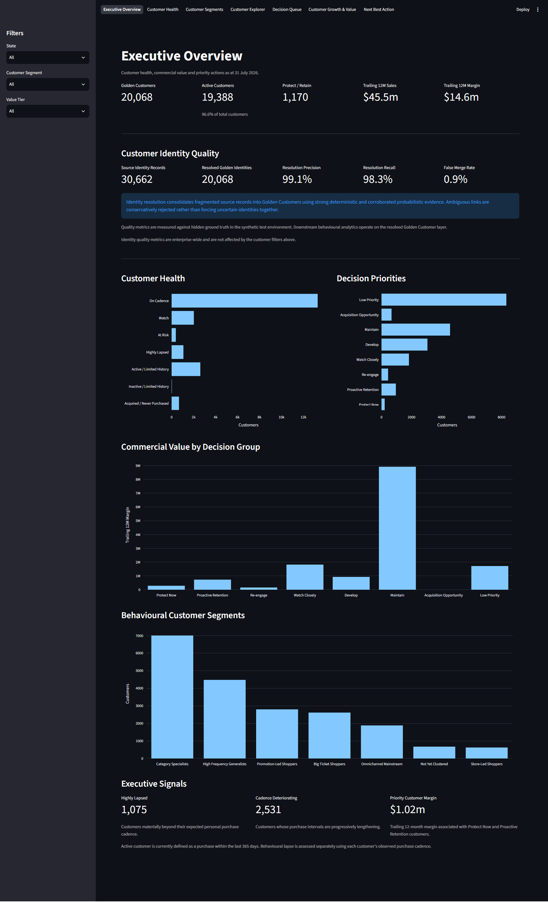
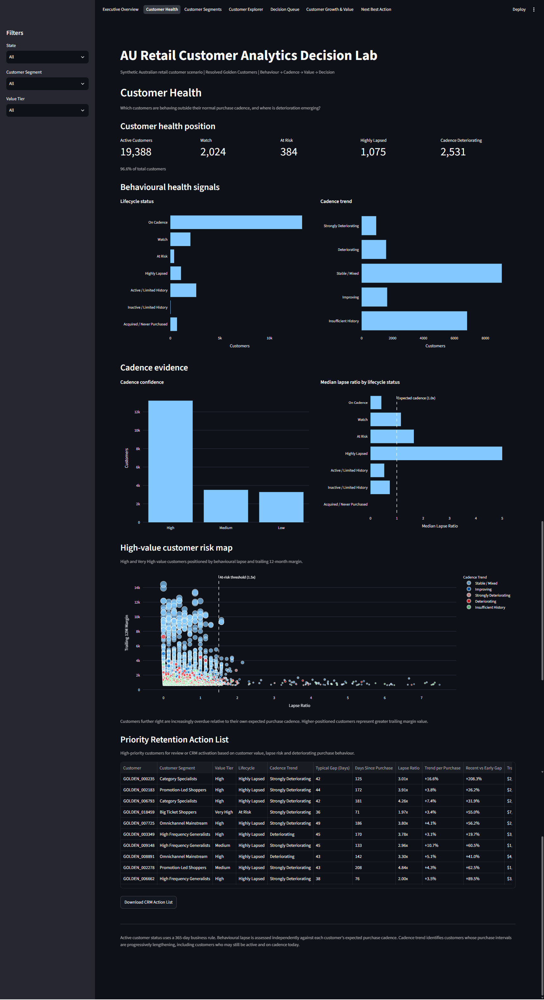
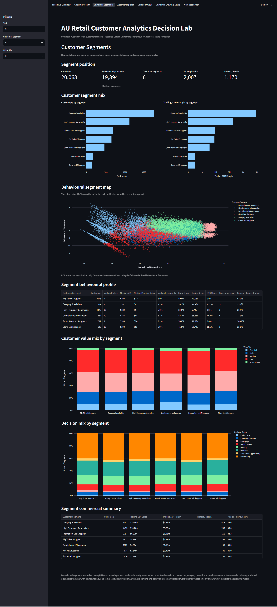
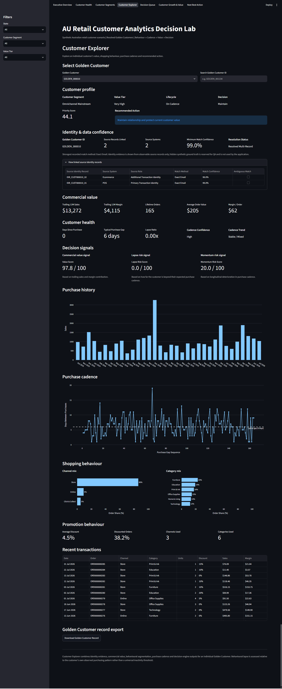
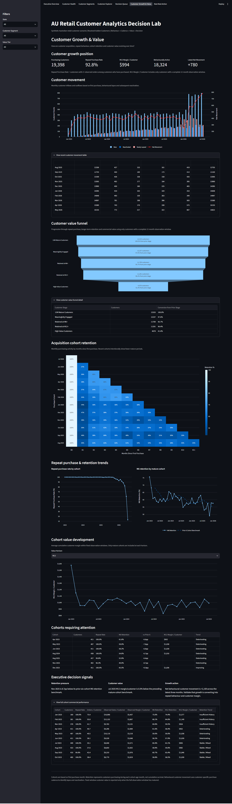
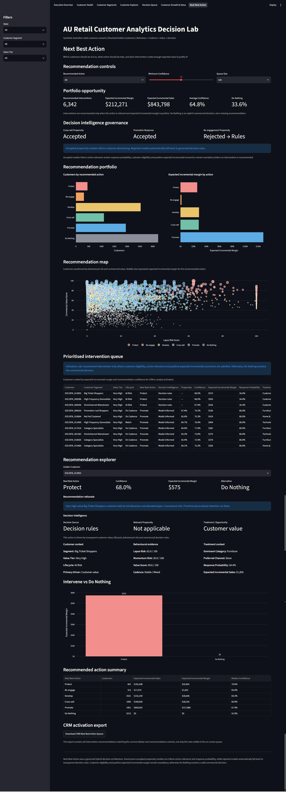
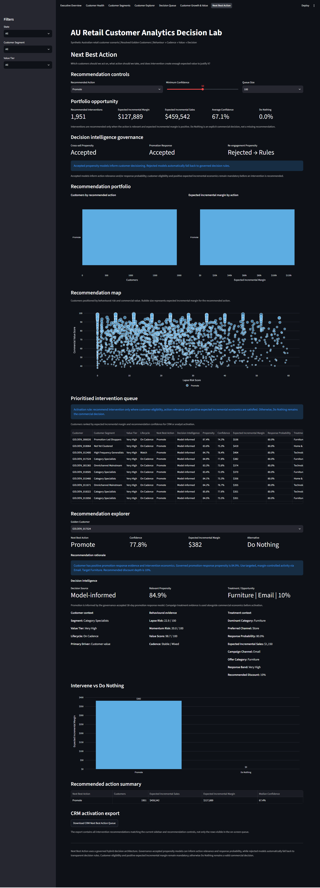
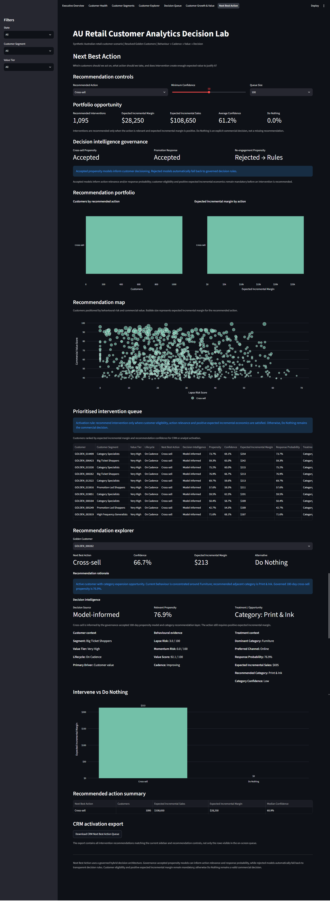

# AU Retail Customer Analytics Decision Lab

An end-to-end retail customer analytics portfolio project demonstrating
how an Australian retailer can move from fragmented customer records and
transaction history to explainable, governed customer decisions.

The project connects **source identity records → identity resolution →
Golden Customer → customer behaviour → purchase cadence → behavioural
lapse → customer value → behavioural segmentation → propensity modelling
→ model governance → expected economics → Next Best Action → CRM
activation** in a single decision workflow.

> **Data note:** All customer, transaction, channel, category, value,
> behavioural and decision records are synthetic. The project
> demonstrates analytical and decision-engineering methods, not observed
> retailer customer performance.

## Live Demo

🚀 **[Launch the AU Retail Customer Analytics Decision
Lab](https://au-retail-customer-analytics-lab.streamlit.app/)**

Explore all seven connected views, from Executive Overview and Customer
Health through Customer Growth & Value and Next Best Action.

## Executive Summary

Retail customer churn is difficult to define because most retailers do
not have a subscription end date or an explicit cancellation event. A
universal inactivity rule can also be misleading: four months without a
purchase may be unusual for a frequent shopper but entirely normal for a
customer who typically shops only a few times per year.

This project builds an analytical decision system around that problem.

Rather than treating every inactive customer as equally at risk, the lab
asks:

-   Which customers are active, lapsing or behaviourally deteriorating?
-   What is normal purchase cadence for each customer?
-   How far is a customer beyond their own expected purchase interval?
-   Is recent purchase behaviour deteriorating relative to historical
    behaviour?
-   Which customers carry enough commercial value to warrant
    intervention?
-   What behavioural customer segments exist across the portfolio?
-   Which high-value customers should be protected first?
-   Which customers should be retained, re-engaged, developed, monitored
    or maintained?
-   Can fragmented customer identities be resolved without aggressively
    merging uncertain records?
-   Do predictive models demonstrate enough out-of-time discrimination,
    lift and calibration to be allowed into customer decisioning?
-   Can the resulting customer queue be exported for CRM activation?

The synthetic environment begins with **20,000 canonical customers** and
deliberately introduces fragmented identity records across multiple
source systems. A conservative identity-resolution layer reconstructs
resolved Golden Customers before downstream analytics are built. The
environment then combines multi-channel transaction history,
customer-specific cadence, lifecycle and lapse logic, customer value
tiers, K-Means behavioural segmentation, longitudinal momentum, governed
propensity models, explainable priority scoring, expected incremental
economics, CRM-oriented decision groups and automated QA.

## Decision Workflow

``` text
Synthetic Customer Master
        ↓
Fragmented Source Identity Records
        ↓
Identity Resolution
        ↓
Resolved Golden Customer Layer
        ↓
Golden Customer Transactions
        ↓
Behaviour + Cadence + Lapse + Momentum
        ↓
Commercial Value + Behavioural Segmentation
        ↓
Priority Decisioning
        ↓
Governed Propensity Models
        ↓
Eligibility + Expected Incremental Economics
        ↓
Next Best Action / Do Nothing
        ↓
CRM Activation
```

The central design principle is:

> **Customer inactivity should be interpreted relative to expected
> customer behaviour, not only a universal churn threshold.**

## Decision Lab Preview

### Executive Overview

**Where are customer health risks, commercial value and decision
priorities concentrated?**



<details>
<summary>
<strong>Customer Health</strong> --- Which customers
are showing behavioural deterioration or elevated lapse risk?
</summary>
`<br>`{=html}



</details>
<details>
<summary>
<strong>Customer Segments</strong> --- What distinct
behavioural customer groups exist, and how do they differ commercially?
</summary>
`<br>`{=html}



</details>
<details>
<summary>
<strong>Customer Explorer</strong> --- What is
happening with an individual customer, and why is a particular action
recommended?
</summary>
`<br>`{=html}



</details>
<details>
<summary>
<strong>Decision Queue</strong> --- Which customers
should the business act on first?
</summary>
`<br>`{=html}


</details>
<details>
<summary>
<strong>Customer Growth & Value</strong> --- How are
acquisition, retention, cohort health and customer value evolving over
time?
</summary>
`<br>`{=html}



</details>
<details>
<summary>
<strong>Next Best Action</strong> --- Which customers
should receive an intervention, which action creates value, and when
should the business deliberately do nothing?
</summary>
`<br>`{=html}



#### Governed Promotion Example

An accepted promotion-response model can inform treatment only after passing
out-of-time discrimination, lift and calibration gates. The customer-level
explorer exposes the relevant propensity, recommended channel, offer category,
discount depth and expected incremental economics.



#### Governed Cross-sell Example

The accepted 180-day cross-sell model estimates category-expansion propensity,
while a separate recommendation layer selects an eligible whitespace category.
The action still requires positive expected incremental economics before
activation.



</details>
## Interactive Decision Lab

The Streamlit application exposes seven connected analytical views.

### 1. Executive Overview

**Question:** Where are customer health risks, commercial value and
decision priorities concentrated?

The portfolio view brings together resolved Golden Customer identity
quality, customer activity, customer value, behavioural health, customer
segments and decision priorities.

A dedicated **Customer Identity Quality** section shows the relationship
between fragmented source identity records and resolved Golden
Customers, together with synthetic QA measures for resolution precision,
recall and false-merge rate. Ambiguous links are deliberately rejected
rather than forcing uncertain identities together.

It is designed to move customer analytics away from isolated customer
counts or generic churn reporting and toward a decision view: which
parts of the customer base matter commercially, where behavioural
deterioration is emerging and where intervention should be prioritised.

Shared filters allow users to explore the customer portfolio by
geography, behavioural segment and value tier.

### 2. Customer Health

**Question:** Which customers are showing behavioural deterioration or
elevated lapse risk?

The Customer Health view focuses on purchase cadence, lapse and
behavioural momentum.

Rather than defining churn using one fixed period of inactivity, the
analysis compares **days since last purchase** with the customer's own
observed purchase pattern. This creates a customer-specific lapse ratio
that distinguishes genuinely unusual inactivity from normal
low-frequency shopping behaviour.

The view also surfaces high-value customer health, behavioural
deterioration and customers requiring retention attention. Priority
customer records can be downloaded for downstream CRM or engagement
activity.

### 3. Customer Segments

**Question:** What distinct behavioural customer groups exist, and how
do they differ commercially?

Behavioural segmentation uses **K-Means clustering** across features
representing purchase intensity, order economics, promotion behaviour,
channel mix, category breadth and purchase cadence.

Six commercially interpretable customer segments are produced:

-   **Big Ticket Shoppers**
-   **High Frequency Generalists**
-   **Promotion-Led Shoppers**
-   **Category Specialists**
-   **Omnichannel Mainstream**
-   **Store-Led Shoppers**

The page compares segment size, trailing margin contribution,
behavioural characteristics, customer value mix and decision mix.

A two-dimensional PCA projection is provided for visualisation of the
behavioural cluster structure. PCA is used for interpretation and
visualisation only; the K-Means model is fitted using the full
standardised behavioural feature set.

Commercial segment names are assigned after clustering to translate
statistical clusters into business language. Synthetic hidden personas
are used only as a validation reference and are not inputs to the
clustering model.

### 4. Customer Explorer

**Question:** What is happening with an individual customer, and why is
a particular action recommended?

Customer Explorer brings together the full analytical story for one
resolved Golden Customer.

The page also exposes **identity and data confidence**, including linked
source records, source systems, match confidence and resolution method.

The page shows behavioural segment, customer value tier, lifecycle
status, decision group, commercial value, purchase cadence, lapse ratio,
cadence confidence, longitudinal momentum, decision signals, purchase
history, channel mix, category mix and promotion behaviour.

The objective is explainability. A user can move from a recommended
action back through the underlying customer signals rather than treating
the decision engine as a black box.

Individual customer records can also be exported for analyst review or
CRM use.

### 5. Decision Queue

**Question:** Which customers should the business act on first?

The Decision Queue converts customer analytics into an operational
worklist.

Users can select a decision group, set a minimum priority score and
control the displayed queue size. The page then shows the customer and
margin exposure associated with the selected actions, a commercial-value
versus lapse-risk priority map, recommended action summaries and a
ranked customer queue.

Decision groups include:

-   **Protect Now**
-   **Proactive Retention**
-   **Re-engage**
-   **Watch Closely**
-   **Develop**
-   **Maintain**
-   **Acquisition Opportunity**
-   **Low Priority**

The full filtered decision queue can be downloaded as a CSV for CRM
activation.

The queue is intended to support prioritisation and human review rather
than automatically contacting customers without business oversight.

### 6. Customer Growth & Value

**Question:** How are customer acquisition, repeat behaviour, cohort
retention and customer value evolving over time?

This page adds a longitudinal portfolio view. Monthly customer movement
separates new customers, reactivations and newly lapsed customers, while
opening and closing behaviourally active populations reconcile from
month to month.

Acquisition cohorts are tracked by months since first purchase. The
retention heatmap focuses on the most recent 12 acquisition cohorts for
readability, while maturity-aware metrics prevent recent cohorts from
being compared against observation windows they have not yet completed.

Fixed-window customer value is measured at M3, M6, M12, M18 and M24 only
when the full observation window is available. This avoids distorting
value simply because one customer has been observed for longer than
another.

The page also includes a maturity-safe customer value funnel:

``` text
12M Mature Customers
        ↓
Meaningfully Engaged
        ↓
Retained at M6+
        ↓
Retained at M12+
        ↓
High-Value Customers
```

Meaningful engagement is defined as at least three orders within the
first 12 months. Executive signals highlight retention pressure, cohort
value development and recent customer growth.

### 7. Next Best Action

**Question:** Which customers should the business act on, what action
should it take, and does intervention create enough expected value to
justify it?

Next Best Action is a **governed hybrid decision architecture** rather
than a single black-box model.

Candidate actions are **Protect, Re-engage, Develop, Cross-sell, Promote
and Do Nothing**. Transparent business rules establish customer
eligibility and action relevance. Where a propensity model has passed
governance, its calibrated probability can inform the relevant
treatment. The action must still clear positive expected incremental
economics before activation.

The current governed model outcomes deliberately demonstrate both sides
of the control:

-   **Cross-sell propensity --- ACCEPTED**
-   **Promotion response propensity --- ACCEPTED**
-   **Re-engagement propensity --- REJECTED → transparent rules
    fallback**

A rejected model is not a pipeline failure. It is prevented from
entering operational customer decisioning, while the existing
explainable rules pathway remains available.

For Cross-sell, the accepted 180-day model is combined with a separate
category-recommendation layer that ranks whitespace categories for each
eligible customer. For Promotion, a synthetic campaign-exposure
environment provides treatment and control observations so the response
model learns from historical campaign outcomes rather than inferring
response from discounted purchases alone.

The page surfaces **Decision Intelligence Governance** alongside
portfolio opportunity, recommendation mix, expected incremental margin,
the recommendation map, prioritised intervention queue and
customer-level recommendation explorer. For model-informed actions, the
explorer exposes the relevant propensity and treatment opportunity; for
rules-driven actions it explicitly identifies the decision source.

**Do Nothing remains an explicit commercial decision, not a missing
recommendation.**

## Why Customer-Specific Cadence Matters

Traditional churn definitions often use a fixed inactivity rule such as
"no purchase in the last 90 days" or "no purchase in the last 12
months."

That can be useful as a business definition of an active customer
population, but it is less effective as an individual behavioural risk
signal.

Consider two customers:

``` text
Customer A
Typical purchase gap: 60 days
Days since last purchase: 120
Lapse ratio: 2.0x

Customer B
Typical purchase gap: 2 days
Days since last purchase: 4
Lapse ratio: 2.0x
```

Both customers are twice their normal purchase interval even though the
absolute inactivity periods are very different.

The project therefore separates two concepts:

1.  **Business lifecycle rules** --- useful for defining active,
    inactive or limited-history populations.
2.  **Behavioural lapse** --- useful for identifying when an individual
    customer is behaving unusually relative to their own historical
    cadence.

This prevents a high-frequency shopper from requiring months of
inactivity before being recognised as unusual while avoiding overly
aggressive churn flags for naturally low-frequency customers.

## Longitudinal Momentum

A single lapse ratio provides a point-in-time signal, but customer
deterioration can develop progressively.

The project therefore includes longitudinal momentum logic to identify
whether recent purchase gaps are worsening relative to prior behaviour.

This creates a second behavioural risk dimension:

-   **Lapse risk** asks whether the customer is currently beyond
    expected cadence.
-   **Momentum risk** asks whether customer behaviour is deteriorating
    over time.

Together they provide more context than recency alone.

## Customer Value

Not every behavioural risk requires the same commercial response.

Customer value measures are therefore combined with lapse and momentum
signals so that intervention can be prioritised toward customers where
the commercial exposure is greatest.

The decision framework uses trailing customer sales and margin to
construct customer value signals and value tiers. These are then
combined with behavioural risk rather than used as a standalone
segmentation method.

This is important because a high-value customer with deteriorating
behaviour represents a different decision problem from a low-value
customer exhibiting the same lapse ratio.

## Behavioural Segmentation

The clustering model is deliberately behavioural rather than
demographic.

Features represent dimensions such as:

-   purchase frequency
-   average order value
-   margin per order
-   units per order
-   discount behaviour
-   channel mix
-   channel breadth
-   category breadth
-   category concentration
-   purchase cadence
-   cadence consistency

K-Means was selected as the primary clustering method because the
objective is to create stable, interpretable and operationally usable
customer groups.

The final number of clusters was selected using statistical diagnostics
together with cluster stability and commercial interpretability rather
than relying on one clustering metric alone.

## Customer Decision Engine

The project uses two connected layers of decisioning.

The first combines customer value, lapse risk, momentum risk, lifecycle
context, cadence confidence and behavioural evidence into an explainable
priority score and customer decision group. This establishes **who
requires attention and why**.

The second is the Next Best Action engine. Candidate treatments are
gated by customer context and commercial relevance, then evaluated using
response probability and expected incremental economics.

The design deliberately avoids machine learning for its own sake. A
recommendation must terminate in a commercial decision.

``` text
Customer Behaviour + Lifecycle + Value
                ↓
        Decision Eligibility
                ↓
        Candidate Actions
                ↓
      Relevance / Context Gates
                ↓
      Response Probability
                ↓
Expected Incremental Sales & Margin
                ↓
 Positive Commercial Hurdle?
        ↙               ↘
      Yes                No
       ↓                  ↓
Intervention         Do Nothing
```

This makes the recommendation logic inspectable and gives analysts a
clear reason for both intervention and non-intervention decisions.

## Identity Resolution & Golden Customer

Customer analytics is only as reliable as the identity layer underneath
it. Real customer data is often fragmented across loyalty, ecommerce,
POS, service and marketing systems, with missing fields, inconsistent
formatting, duplicate records and shared household attributes.

The project therefore creates a deliberately messy synthetic source
layer and resolves it into a **Golden Customer** population using
conservative deterministic and corroborated probabilistic evidence.

The resolver uses strong evidence such as email and phone matches,
supported by name and address similarity where appropriate. A
**cluster-wide consistency gate** prevents a weak bridge from combining
otherwise separate customer identities. Accepted and rejected candidate
edges are retained in an audit artefact with rejection reasons.

> **An uncertain split is preferable to an incorrect merge.**

Hidden synthetic ground truth is used only for QA and validation. It is
not available to the resolver as a feature and is not used by downstream
behavioural models.

The identity layer reports source identity records, resolved Golden
Customer identities, resolution precision and recall, false-merge rate,
match method and confidence, accepted/rejected edge decisions,
contaminated-cluster diagnostics and shared-household protection. In the
current reproducible build, **30,662 fragmented source identity records resolve
to 20,068 Golden Customers**, with **99.1% precision, 98.3% recall and a 0.9%
false-merge rate** against hidden synthetic ground truth.

## Propensity Models & Model Governance

The propensity layer asks:

> **Given what was known at an historical observation date, how likely
> was the relevant future customer event?**

Historical snapshots are created using only information available at
each observation date. Outcomes are then measured in a future window.
This creates a genuine **features-at-time-T → observed-future-outcome**
design and protects against target leakage.

Three use cases are demonstrated:

-   **Re-engagement / 90-day return propensity** --- predicts whether an
    eligible lapsed customer purchases in the following 90 days. The
    model is **REJECTED** because it does not clear the out-of-time
    governance hurdle, so NBA retains transparent rules.
-   **Cross-sell propensity** --- predicts whether an eligible customer
    enters a new product category within the following 180 days. The
    model is **ACCEPTED** and is paired with a category-recommendation
    layer.
-   **Promotion response propensity** --- predicts response to a future
    promotional treatment. Historical synthetic campaign exposures
    include both **treatment and control** observations. The model is
    **ACCEPTED** and can score current promotion opportunities.

### Governance gates

Candidate models are evaluated against an out-of-time holdout and
recent-base-rate benchmark. Governance includes **ROC-AUC, PR-AUC lift,
top-decile lift, top-quintile lift, calibration gap and Brier score
versus baseline**.

Logistic Regression and HistGradientBoosting candidates are compared,
with calibration applied before operational use. Model selection is
separated from model acceptance: the strongest candidate can still be
rejected if it does not clear the governance hurdle.

``` text
Historical Observable Features
            ↓
Future Outcome Window
            ↓
Temporal Train / Validation / OOT Test
            ↓
Candidate Model Comparison + Calibration
            ↓
Governance Gates
       ↙            ↘
   ACCEPTED        REJECTED
      ↓               ↓
Operational Score   Rules Fallback
       \             /
        ↓           ↓
 Eligibility + Expected Economics
                ↓
        Next Best Action
```

**Model failure is therefore a governed business outcome, not a
technical pipeline failure.**

## CRM Activation

Analytics creates value only when it can be connected to action.

The Decision Queue therefore supports CSV export of the selected
customer population with customer segment, value tier, lifecycle,
cadence, lapse, risk, commercial value, priority score, decision group
and recommended action.

This represents the hand-off point between analytical decisioning and
CRM execution.

In a production environment, the same output could feed campaign
orchestration, customer-service workflows, loyalty platforms or
experimentation frameworks.

## Synthetic Australian Retail Environment

The project uses synthetic data designed to resemble a multi-channel
Australian retail customer environment, including:

-   **20,000 canonical customers**
-   fragmented multi-source identity records and hidden QA ground truth
-   conservative Golden Customer identity resolution
-   customer transaction history
-   multiple Australian states
-   Store, Online and Click & Collect behaviour
-   multiple retail categories
-   order and unit behaviour
-   customer sales and gross margin
-   discount and promotion behaviour
-   heterogeneous purchase frequencies
-   customer-specific purchase cadence
-   different underlying behavioural personas
-   lifecycle and lapse states
-   behavioural momentum
-   customer value tiers
-   historical campaign treatment/control exposures
-   governed re-engagement, cross-sell and promotion-response propensity
    modelling
-   cross-sell category recommendations
-   model-governance and operational-scoring outputs
-   CRM decision outputs

No real retailer customer or transaction data is represented in the
repository.

## Repository Structure

``` text
au-retail-customer-analytics-decision-lab/
├── app.py
├── app_pages/
│   ├── 1_Executive_Overview.py
│   ├── 2_Customer_Health.py
│   ├── 3_Customer_Segments.py
│   ├── 4_Customer_Explorer.py
│   ├── 5_Decision_Queue.py
│   ├── 6_Customer_Growth_Value.py
│   └── 7_Next_Best_Action.py
├── data/
│   ├── generated/
│   └── runtime/
├── docs/
│   └── images/
│       ├── 1_Executive_Overview.png
│       ├── 2_Customer_Health.png
│       ├── 3_Customer_Segments.png
│       ├── 4_Customer_Explorer.png
│       ├── 5_Decision_Queue.png
│       ├── 6_Customer_Growth_Value.png
│       ├── 7_Next_Best_Action.png
│       ├── 7_Next_Best_Action_Promote.png
│       └── 7_Next_Best_Action_Cross_Sell.png
├── src/
│   ├── app/
│   ├── customer/
│   ├── data_generation/
│   ├── decision_engine/
│   ├── modelling/
│   └── qa/
├── tests/
├── build_all.py
├── requirements.txt
└── pytest.ini
```

Generated analytical outputs are separated from application code so the
pipeline can be rebuilt and validated independently of the Streamlit
presentation layer.

## Deployment Data

The deployed application uses curated generated and runtime Parquet
assets required by the seven analytical pages, including transaction,
customer decision, cohort/value and Next Best Action outputs.

Intermediate analytical outputs can remain excluded from version control
where they are not required for deployment. Separating deployment assets
from rebuildable pipeline outputs keeps the repository focused while
allowing the live application to start quickly and provide a consistent
demonstration experience.

The application is deployed using **Python 3.11** on **Streamlit
Community Cloud**, with runtime dependencies managed through
`requirements.txt`.

## Testing and Portfolio QA

The project includes automated regression and governance tests across
identity resolution, customer analytics, cohort/value logic, propensity
modelling and Next Best Action.

Current clean regression checkpoint:

``` text
31 passed
```

The complete analytical rebuild currently executes **28 pipeline and QA
steps** before the regression suite is run.

The suite validates identity-resolution quality thresholds and
ground-truth leakage controls; shared-household protection; uniqueness
of customer-level outputs; transaction-to-customer reconciliation;
cohort and fixed-window LTV maturity; temporal propensity leakage
guards; probability and governance-status controls; accepted-model
versus rules-fallback behaviour; cross-sell category recommendation
validity; approved Next Best Action taxonomy; positive expected
incremental economics for interventions; zero incremental economics for
Do Nothing; and populated recommendation rationale for explainability.

The application has also been manually validated across all seven pages,
including shared filters, Golden Customer identity evidence, cohort
visualisation, customer exploration, model-governance status,
recommendation controls and CSV export behaviour.

## Reproducibility

### Activate the environment

``` bash
conda activate au-retail-customer
```

### Build the analytical outputs

``` bash
python build_all.py --with-qa
```

### Run tests

``` bash
python -m pytest -q
```

### Launch the decision application

``` bash
streamlit run app.py
```

## Methodology

The customer decision framework follows twelve broad stages:

1.  **Synthetic source foundation** --- A canonical customer master and
    transaction history are generated together with deliberately
    fragmented source identity records.
2.  **Identity resolution** --- Source identities are conservatively
    resolved using deterministic and corroborated probabilistic
    evidence, cluster-consistency controls and edge-level auditability.
3.  **Golden Customer layer** --- Resolved identities are connected to
    the analytical transaction layer to create the downstream customer
    foundation.
4.  **Customer behaviour features** --- Transaction history is
    transformed into behavioural, commercial, channel, category and
    cadence features.
5.  **Cadence, lapse and momentum** --- Expected purchase cadence,
    current inactivity and longitudinal deterioration are calculated.
6.  **Customer value** --- Commercial contribution is translated into
    customer value scores and tiers.
7.  **Behavioural segmentation** --- Standardised behavioural features
    are clustered using K-Means and translated into commercially
    interpretable segments.
8.  **Cohort and fixed-window value** --- Acquisition cohorts, customer
    movement and maturity-aware M3/M6/M12/M18/M24 value measures provide
    a longitudinal view.
9.  **Priority decisioning** --- Value, lapse, momentum and customer
    context are combined into explainable priority scores and decision
    groups.
10. **Historical propensity learning** --- Observation-date features are
    paired with future outcome windows for re-engagement, cross-sell and
    promotion-response use cases.
11. **Model governance and operational scoring** --- Candidate models
    are evaluated out of time for discrimination, lift and calibration.
    Accepted models can score current opportunities; rejected models are
    blocked and fall back to transparent rules.
12. **Next Best Action** --- Eligibility, governed propensity where
    available, treatment context and expected incremental economics
    determine whether to recommend an intervention or Do Nothing.

## Limitations

This is a portfolio customer decision-analytics prototype rather than a
production CRM or churn-management system. Important limitations
include:

-   synthetic rather than observed retailer customer data
-   no demographic or personally identifiable customer information
-   simplified transaction, identity and campaign behaviour
-   lifecycle rules are analytical assumptions rather than
    retailer-calibrated definitions
-   customer cadence is inferred only from observed transaction history
-   sparse-history customers have inherently lower cadence confidence
-   behavioural lapse is not equivalent to confirmed churn
-   propensity models estimate observed response probability, not causal
    incremental treatment effect
-   promotion treatment/control data is synthetic and demonstrates
    experimental structure rather than real-world campaign causality
-   expected incremental economics are synthetic decision assumptions
    rather than experimentally calibrated realised value
-   no persistent marketing-contact history, treatment-fatigue or
    contact-policy optimisation
-   cross-sell recommendation operates at category rather than SKU level
-   fixed-window LTV is observed/maturity-aware value rather than a
    probabilistic lifetime forecast
-   K-Means assumes a fixed partition of behavioural space
-   PCA is used for cluster visualisation rather than model fitting
-   priority scores and decision thresholds are analytical guardrails
    rather than production-calibrated policies
-   CRM export demonstrates workflow integration rather than live
    customer activation

## Potential Next Steps

Production-oriented extensions could include survival analysis or
probabilistic time-to-next-purchase modelling, probabilistic lifetime
value forecasting, causal uplift modelling using real randomised
campaign experiments, treatment-fatigue and contact-policy optimisation,
loyalty behaviour, SKU-level product affinity and recommendation
modelling, sequence-based customer embeddings, dynamic segment
migration, real-time event triggers, live CRM integration, model drift
monitoring, recommendation monitoring and realised incremental-value
measurement.

## Skills Demonstrated

**Analytics & Data Science:** business problem framing, synthetic data
design, customer feature engineering, purchase-cadence analysis,
behavioural lapse logic, longitudinal trend analysis, K-Means clustering,
PCA visualisation, customer value scoring, acquisition cohort analysis,
retention measurement, maturity-aware fixed-window LTV, temporal propensity
modelling, Logistic Regression, HistGradientBoosting, probability calibration
and analytical validation.

**Decision Intelligence & Model Governance:** identity-resolution quality
controls, temporal leakage prevention, out-of-time validation, ROC-AUC and
PR-AUC assessment, decile/quintile lift, calibration and Brier-score gates,
champion-model selection, explicit model acceptance/rejection, governed rules
fallback, expected incremental economics, category recommendation, hybrid Next
Best Action design, explicit Do Nothing decisions and recommendation
explainability.

**Analytics Engineering:** modular Python development, parquet-based analytical
datasets, reproducible 28-step build and QA pipeline, automated regression
testing, edge-level identity audit artefacts, model metadata and governance
outputs, Streamlit application development, Streamlit Community Cloud
deployment, reusable filters, CRM-ready CSV activation outputs, Git-ready
project organisation and technical documentation.

## Project Perspective

The project is intentionally designed around the connection between
**customer analytics and commercial action**.

A customer who has not purchased for four months is not automatically
churned. For one customer that may represent twice their normal purchase
interval; for another it may be completely normal behaviour. Likewise, a
behavioural deterioration signal is not enough on its own to determine
commercial priority.

The analytical objective is therefore not simply to segment customers or
assign a churn flag.

It is to establish a trustworthy customer identity, understand expected
behaviour, identify meaningful deviation, determine whether predictive
evidence is strong enough to use, combine that evidence with commercial
value and translate the result into an explainable action.

> **Who is the customer, what is changing, is the predictive evidence
> trustworthy, and what should the business do next?**
