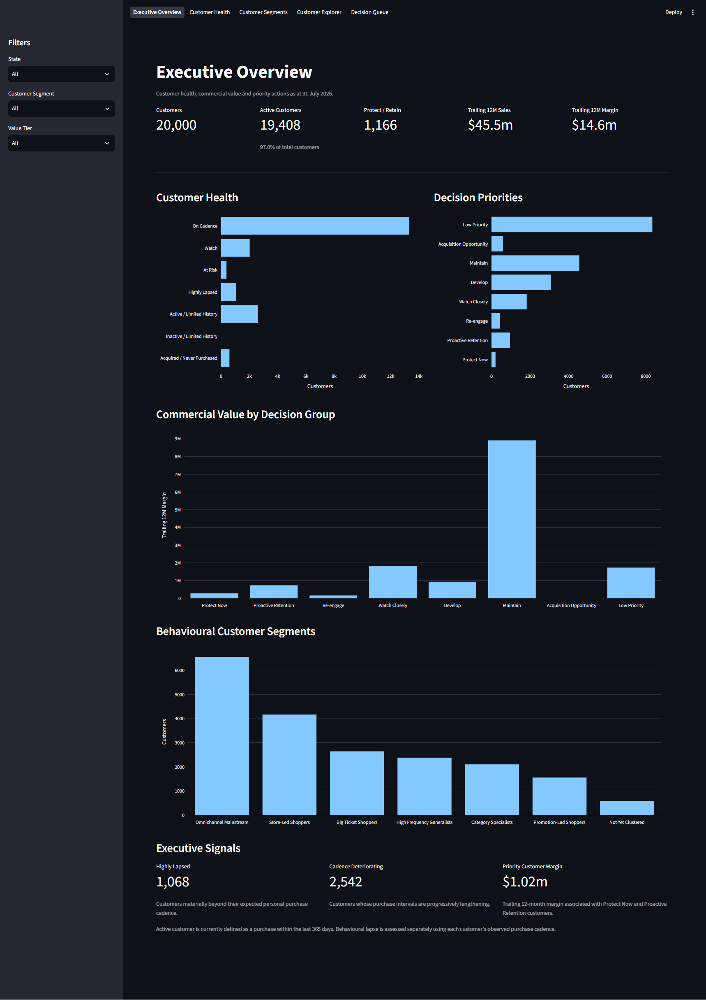
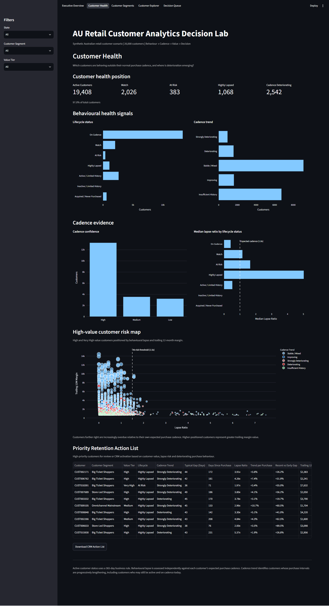
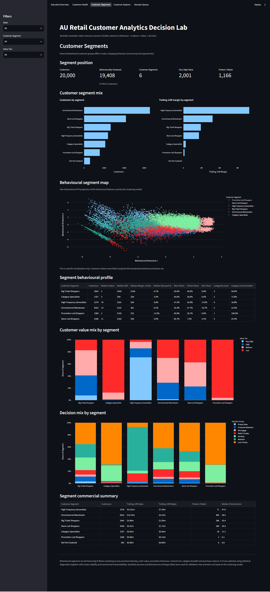
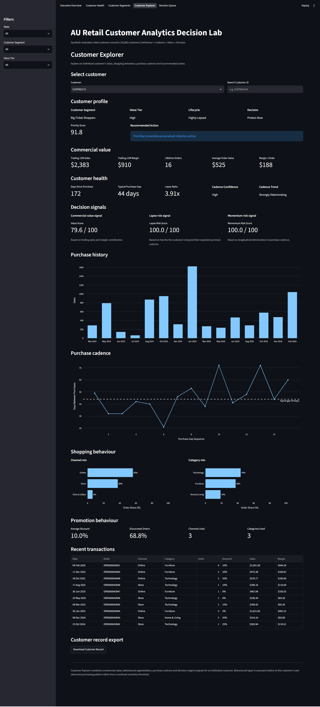
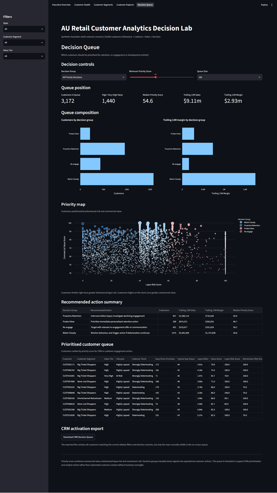
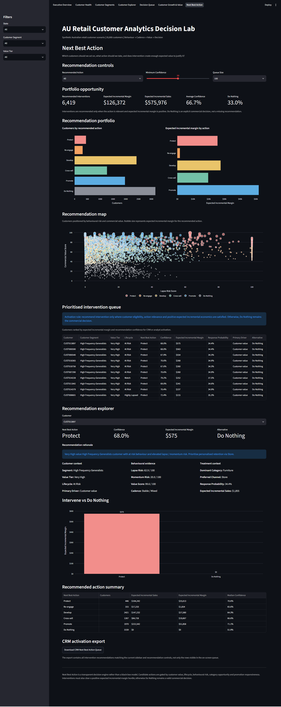

# AU Retail Customer Analytics Decision Lab

An end-to-end retail customer analytics portfolio project demonstrating how an Australian retailer can move from customer transaction history to explainable retention, re-engagement and customer-development decisions.

The project connects **customer behaviour → purchase cadence → behavioural lapse → customer value → behavioural segmentation → priority scoring → recommended action → CRM activation** in a single decision workflow.

> **Data note:** All customer, transaction, channel, category, value, behavioural and decision records are synthetic. The project demonstrates analytical and decision-engineering methods, not observed retailer customer performance.

## Live Demo

🚀 **[Launch the AU Retail Customer Analytics Decision Lab](https://au-retail-customer-analytics-lab.streamlit.app/)**

Explore all seven connected views, from Executive Overview and Customer Health through Customer Growth & Value and Next Best Action.

## Executive Summary

Retail customer churn is difficult to define because most retailers do not have a subscription end date or an explicit cancellation event. A universal inactivity rule can also be misleading: four months without a purchase may be unusual for a frequent shopper but entirely normal for a customer who typically shops only a few times per year.

This project builds an analytical decision system around that problem.

Rather than treating every inactive customer as equally at risk, the lab asks:

- Which customers are active, lapsing or behaviourally deteriorating?
- What is normal purchase cadence for each customer?
- How far is a customer beyond their own expected purchase interval?
- Is recent purchase behaviour deteriorating relative to historical behaviour?
- Which customers carry enough commercial value to warrant intervention?
- What behavioural customer segments exist across the portfolio?
- Which high-value customers should be protected first?
- Which customers should be retained, re-engaged, developed, monitored or maintained?
- Can the resulting customer queue be exported for CRM activation?

The synthetic environment contains **20,000 customers** with transaction history across multiple retail channels and categories, customer-specific cadence features, lifecycle and lapse logic, customer value tiers, K-Means behavioural segmentation, longitudinal momentum signals, explainable priority scoring, CRM-oriented decision groups and automated QA.

## Decision Workflow

```text
Synthetic Customer Transactions
        ↓
Customer Behaviour Features
        ↓
Purchase Cadence
        ↓
Customer-Specific Lapse Assessment
        ↓
Longitudinal Momentum
        ↓
Commercial Value
        ↓
Behavioural Segmentation
        ↓
Priority Scoring
        ↓
Decision Group
        ↓
CRM Activation Queue
        ↓
Business Decision
```

The central design principle is:

> **Customer inactivity should be interpreted relative to expected customer behaviour, not only a universal churn threshold.**

## Decision Lab Preview

### Executive Overview

**Where are customer health risks, commercial value and decision priorities concentrated?**



<details>
<summary><strong>Customer Health</strong> — Which customers are showing behavioural deterioration or elevated lapse risk?</summary>

<br>



</details>

<details>
<summary><strong>Customer Segments</strong> — What distinct behavioural customer groups exist, and how do they differ commercially?</summary>

<br>



</details>

<details>
<summary><strong>Customer Explorer</strong> — What is happening with an individual customer, and why is a particular action recommended?</summary>

<br>



</details>

<details>
<summary><strong>Decision Queue</strong> — Which customers should the business act on first?</summary>

<br>



</details>

<details>
<summary><strong>Customer Growth & Value</strong> — How are acquisition, retention, cohort health and customer value evolving over time?</summary>

<br>


</details>

<details>
<summary><strong>Next Best Action</strong> — Which customers should receive an intervention, which action creates value, and when should the business deliberately do nothing?</summary>

<br>



</details>

## Interactive Decision Lab

The Streamlit application exposes seven connected analytical views.

### 1. Executive Overview

**Question:** Where are customer health risks, commercial value and decision priorities concentrated?

The portfolio view brings together customer activity, customer value, behavioural health, customer segments and decision priorities.

It is designed to move customer analytics away from isolated customer counts or generic churn reporting and toward a decision view: which parts of the customer base matter commercially, where behavioural deterioration is emerging and where intervention should be prioritised.

Shared filters allow users to explore the customer portfolio by geography, behavioural segment and value tier.

### 2. Customer Health

**Question:** Which customers are showing behavioural deterioration or elevated lapse risk?

The Customer Health view focuses on purchase cadence, lapse and behavioural momentum.

Rather than defining churn using one fixed period of inactivity, the analysis compares **days since last purchase** with the customer's own observed purchase pattern. This creates a customer-specific lapse ratio that distinguishes genuinely unusual inactivity from normal low-frequency shopping behaviour.

The view also surfaces high-value customer health, behavioural deterioration and customers requiring retention attention. Priority customer records can be downloaded for downstream CRM or engagement activity.

### 3. Customer Segments

**Question:** What distinct behavioural customer groups exist, and how do they differ commercially?

Behavioural segmentation uses **K-Means clustering** across features representing purchase intensity, order economics, promotion behaviour, channel mix, category breadth and purchase cadence.

Six commercially interpretable customer segments are produced:

- **Big Ticket Shoppers**
- **High Frequency Generalists**
- **Promotion-Led Shoppers**
- **Category Specialists**
- **Omnichannel Mainstream**
- **Store-Led Shoppers**

The page compares segment size, trailing margin contribution, behavioural characteristics, customer value mix and decision mix.

A two-dimensional PCA projection is provided for visualisation of the behavioural cluster structure. PCA is used for interpretation and visualisation only; the K-Means model is fitted using the full standardised behavioural feature set.

Commercial segment names are assigned after clustering to translate statistical clusters into business language. Synthetic hidden personas are used only as a validation reference and are not inputs to the clustering model.

### 4. Customer Explorer

**Question:** What is happening with an individual customer, and why is a particular action recommended?

Customer Explorer brings together the full analytical story for one customer.

The page shows behavioural segment, customer value tier, lifecycle status, decision group, commercial value, purchase cadence, lapse ratio, cadence confidence, longitudinal momentum, decision signals, purchase history, channel mix, category mix and promotion behaviour.

The objective is explainability. A user can move from a recommended action back through the underlying customer signals rather than treating the decision engine as a black box.

Individual customer records can also be exported for analyst review or CRM use.

### 5. Decision Queue

**Question:** Which customers should the business act on first?

The Decision Queue converts customer analytics into an operational worklist.

Users can select a decision group, set a minimum priority score and control the displayed queue size. The page then shows the customer and margin exposure associated with the selected actions, a commercial-value versus lapse-risk priority map, recommended action summaries and a ranked customer queue.

Decision groups include:

- **Protect Now**
- **Proactive Retention**
- **Re-engage**
- **Watch Closely**
- **Develop**
- **Maintain**
- **Acquisition Opportunity**
- **Low Priority**

The full filtered decision queue can be downloaded as a CSV for CRM activation.

The queue is intended to support prioritisation and human review rather than automatically contacting customers without business oversight.

### 6. Customer Growth & Value

**Question:** How are customer acquisition, repeat behaviour, cohort retention and customer value evolving over time?

This page adds a longitudinal portfolio view. Monthly customer movement separates new customers, reactivations and newly lapsed customers, while opening and closing behaviourally active populations reconcile from month to month.

Acquisition cohorts are tracked by months since first purchase. The retention heatmap focuses on the most recent 12 acquisition cohorts for readability, while maturity-aware metrics prevent recent cohorts from being compared against observation windows they have not yet completed.

Fixed-window customer value is measured at M3, M6, M12, M18 and M24 only when the full observation window is available. This avoids distorting value simply because one customer has been observed for longer than another.

The page also includes a maturity-safe customer value funnel:

```text
12M Mature Customers
        ↓
Meaningfully Engaged
        ↓
Retained at M6+
        ↓
Retained at M12+
        ↓
High-Value Customers
```

Meaningful engagement is defined as at least three orders within the first 12 months. Executive signals highlight retention pressure, cohort value development and recent customer growth.

### 7. Next Best Action

**Question:** Which customers should the business act on, what action should it take, and does intervention create enough expected value to justify it?

Next Best Action converts behavioural, lifecycle and commercial signals into a transparent customer-level recommendation engine.

Candidate actions are **Protect, Re-engage, Develop, Cross-sell, Promote and Do Nothing**.

Actions are gated by customer eligibility and relevance, including customer value, lifecycle state, behavioural lapse and momentum risk, category opportunity and promotion responsiveness. The engine then estimates response probability, expected incremental sales and expected incremental margin.

An intervention is recommended only when the customer is eligible, the action is relevant and expected incremental economics are positive. **Do Nothing is therefore an explicit commercial decision, not a missing recommendation.**

The page provides portfolio opportunity metrics, action mix, expected incremental margin by action, a behavioural-risk versus commercial-value recommendation map, a prioritised intervention queue and a customer-level recommendation explorer. The filtered intervention population can be exported as a CRM-ready queue.


## Why Customer-Specific Cadence Matters

Traditional churn definitions often use a fixed inactivity rule such as "no purchase in the last 90 days" or "no purchase in the last 12 months."

That can be useful as a business definition of an active customer population, but it is less effective as an individual behavioural risk signal.

Consider two customers:

```text
Customer A
Typical purchase gap: 60 days
Days since last purchase: 120
Lapse ratio: 2.0x

Customer B
Typical purchase gap: 2 days
Days since last purchase: 4
Lapse ratio: 2.0x
```

Both customers are twice their normal purchase interval even though the absolute inactivity periods are very different.

The project therefore separates two concepts:

1. **Business lifecycle rules** — useful for defining active, inactive or limited-history populations.
2. **Behavioural lapse** — useful for identifying when an individual customer is behaving unusually relative to their own historical cadence.

This prevents a high-frequency shopper from requiring months of inactivity before being recognised as unusual while avoiding overly aggressive churn flags for naturally low-frequency customers.

## Longitudinal Momentum

A single lapse ratio provides a point-in-time signal, but customer deterioration can develop progressively.

The project therefore includes longitudinal momentum logic to identify whether recent purchase gaps are worsening relative to prior behaviour.

This creates a second behavioural risk dimension:

- **Lapse risk** asks whether the customer is currently beyond expected cadence.
- **Momentum risk** asks whether customer behaviour is deteriorating over time.

Together they provide more context than recency alone.

## Customer Value

Not every behavioural risk requires the same commercial response.

Customer value measures are therefore combined with lapse and momentum signals so that intervention can be prioritised toward customers where the commercial exposure is greatest.

The decision framework uses trailing customer sales and margin to construct customer value signals and value tiers. These are then combined with behavioural risk rather than used as a standalone segmentation method.

This is important because a high-value customer with deteriorating behaviour represents a different decision problem from a low-value customer exhibiting the same lapse ratio.

## Behavioural Segmentation

The clustering model is deliberately behavioural rather than demographic.

Features represent dimensions such as:

- purchase frequency
- average order value
- margin per order
- units per order
- discount behaviour
- channel mix
- channel breadth
- category breadth
- category concentration
- purchase cadence
- cadence consistency

K-Means was selected as the primary clustering method because the objective is to create stable, interpretable and operationally usable customer groups.

The final number of clusters was selected using statistical diagnostics together with cluster stability and commercial interpretability rather than relying on one clustering metric alone.

## Customer Decision Engine

The project uses two connected layers of decisioning.

The first combines customer value, lapse risk, momentum risk, lifecycle context, cadence confidence and behavioural evidence into an explainable priority score and customer decision group. This establishes **who requires attention and why**.

The second is the Next Best Action engine. Candidate treatments are gated by customer context and commercial relevance, then evaluated using response probability and expected incremental economics.

The design deliberately avoids machine learning for its own sake. A recommendation must terminate in a commercial decision.

```text
Customer Behaviour + Lifecycle + Value
                ↓
        Decision Eligibility
                ↓
        Candidate Actions
                ↓
      Relevance / Context Gates
                ↓
      Response Probability
                ↓
Expected Incremental Sales & Margin
                ↓
 Positive Commercial Hurdle?
        ↙               ↘
      Yes                No
       ↓                  ↓
Intervention         Do Nothing
```

This makes the recommendation logic inspectable and gives analysts a clear reason for both intervention and non-intervention decisions.

## CRM Activation

Analytics creates value only when it can be connected to action.

The Decision Queue therefore supports CSV export of the selected customer population with customer segment, value tier, lifecycle, cadence, lapse, risk, commercial value, priority score, decision group and recommended action.

This represents the hand-off point between analytical decisioning and CRM execution.

In a production environment, the same output could feed campaign orchestration, customer-service workflows, loyalty platforms or experimentation frameworks.

## Synthetic Australian Retail Environment

The project uses synthetic data designed to resemble a multi-channel Australian retail customer environment, including:

- **20,000 customers**
- customer transaction history
- multiple Australian states
- Store, Online and Click & Collect behaviour
- multiple retail categories
- order and unit behaviour
- customer sales and gross margin
- discount and promotion behaviour
- heterogeneous purchase frequencies
- customer-specific purchase cadence
- different underlying behavioural personas
- lifecycle and lapse states
- behavioural momentum
- customer value tiers
- CRM decision outputs

No real retailer customer or transaction data is represented in the repository.

## Repository Structure

```text
au-retail-customer-analytics-decision-lab/
├── app.py
├── app_pages/
│   ├── 1_Executive_Overview.py
│   ├── 2_Customer_Health.py
│   ├── 3_Customer_Segments.py
│   ├── 4_Customer_Explorer.py
│   ├── 5_Decision_Queue.py
│   ├── 6_Customer_Growth_Value.py
│   └── 7_Next_Best_Action.py
├── data/
│   ├── generated/
│   └── runtime/
├── docs/
│   └── images/
│       ├── 01_executive_overview.png
│       ├── 02_customer_health.png
│       ├── 03_customer_segments.png
│       ├── 04_customer_explorer.png
│       ├── 05_decision_queue.png
│       ├── 06_customer_growth_value.png
│       └── 07_next_best_action.png
├── src/
│   ├── app/
│   ├── customer/
│   ├── data_generation/
│   ├── decision_engine/
│   ├── modelling/
│   └── qa/
├── tests/
├── build_all.py
├── requirements.txt
└── pytest.ini
```

Generated analytical outputs are separated from application code so the pipeline can be rebuilt and validated independently of the Streamlit presentation layer.

## Deployment Data

The deployed application uses curated generated and runtime Parquet assets required by the seven analytical pages, including transaction, customer decision, cohort/value and Next Best Action outputs.

Intermediate analytical outputs can remain excluded from version control where they are not required for deployment. Separating deployment assets from rebuildable pipeline outputs keeps the repository focused while allowing the live application to start quickly and provide a consistent demonstration experience.

The application is deployed using **Python 3.11** on **Streamlit Community Cloud**, with runtime dependencies managed through `requirements.txt`.

## Testing and Portfolio QA

The project includes automated tests covering the core customer analytics, cohort/value calculations and decision logic.

Current test suite:

```text
19 passed
```

The suite validates, among other controls:

- one final priority and Next Best Action record per customer
- unique customer IDs in customer-level decision outputs
- customer sales and margin reconciliation back to transaction history
- fixed-window LTV maturity and suppression of immature value windows
- 100% M0 purchasing activity for acquisition cohorts
- monthly customer movement reconciliation
- cohort maturity controls for retention and value measures
- approved Next Best Action taxonomy
- valid confidence and response-probability bounds
- positive expected incremental economics for recommended interventions
- zero incremental economics for Do Nothing
- populated recommendation drivers, alternatives and rationale for explainability

The application has also been manually validated across all seven pages, including shared filters, cohort visualisation, customer exploration, recommendation controls and CSV export behaviour.

## Reproducibility

### Activate the environment

```bash
conda activate au-retail-customer
```

### Build the analytical outputs

```bash
python build_all.py --with-qa
```

### Run tests

```bash
python -m pytest -q
```

### Launch the decision application

```bash
streamlit run app.py
```

## Methodology

The customer decision framework follows nine broad stages:

1. **Transaction foundation** — Synthetic customer transactions capture purchase timing, channel, category, units, sales, margin and promotional behaviour.
2. **Customer behaviour features** — Transaction history is transformed into customer-level behavioural, commercial, channel, category and cadence features.
3. **Cadence and lapse** — Customer-specific expected purchase cadence is compared with current inactivity to identify unusual lapse behaviour.
4. **Longitudinal momentum** — Recent purchase intervals are compared with historical behaviour to identify deterioration.
5. **Customer value** — Commercial contribution is translated into customer value scores and tiers.
6. **Behavioural segmentation** — Standardised behavioural features are clustered using K-Means and translated into commercially interpretable segments.
7. **Cohort and fixed-window value** — Acquisition cohorts, customer movement and maturity-aware M3/M6/M12/M18/M24 value measures provide a longitudinal view.
8. **Priority decisioning** — Value, lapse, momentum and customer context are combined into priority scores and explainable decision groups.
9. **Next Best Action** — Candidate interventions are gated by relevance and context, evaluated on expected response and incremental economics, and either recommended or resolved to Do Nothing.

## Limitations

This is a portfolio customer decision-analytics prototype rather than a production CRM or churn-management system. Important limitations include:

- synthetic rather than observed retailer customer data
- no demographic or personally identifiable customer information
- simplified transaction and promotion behaviour
- lifecycle rules are analytical assumptions rather than retailer-calibrated definitions
- customer cadence is inferred only from observed transaction history
- sparse-history customers have inherently lower cadence confidence
- behavioural lapse is not equivalent to confirmed churn
- no causal uplift estimate of whether an intervention will retain or incrementally change customer behaviour
- response probabilities and incremental economics are synthetic analytical assumptions rather than experimentally calibrated causal estimates
- no marketing-contact history, treatment-fatigue or contact-policy optimisation
- no SKU-level product recommendation engine
- fixed-window LTV is observed/maturity-aware value rather than a probabilistic lifetime forecast
- K-Means assumes a fixed partition of behavioural space
- PCA is used for cluster visualisation rather than model fitting
- priority scores and decision thresholds are analytical guardrails rather than production-calibrated policies
- CRM export demonstrates workflow integration rather than live customer activation

## Potential Next Steps

Production-oriented extensions could include survival analysis or probabilistic time-to-next-purchase modelling, probabilistic lifetime value forecasting, experimentally calibrated offer-response and uplift modelling, campaign experimentation, contact-policy optimisation, loyalty behaviour, SKU-level product affinity and recommendation modelling, sequence-based customer embeddings, dynamic segment migration, real-time event triggers, live CRM integration, recommendation monitoring and realised incremental-value measurement.

## Skills Demonstrated

**Analytics & Data Science:** business problem framing, synthetic data design, customer feature engineering, purchase-cadence analysis, behavioural lapse logic, longitudinal trend analysis, K-Means clustering, PCA visualisation, customer value scoring, acquisition cohort analysis, retention measurement, maturity-aware fixed-window LTV and analytical validation.

**Decision Analytics:** customer health assessment, behavioural risk prioritisation, commercial value integration, explainable customer decision groups, retention and re-engagement logic, customer-level investigation, CRM activation queues, Next Best Action design, positive-economics intervention gating, explicit Do Nothing decisions, recommendation explainability and operational prioritisation.

**Analytics Engineering:** modular Python development, parquet-based analytical datasets, reproducible build pipeline, automated testing, Streamlit application development, Streamlit Community Cloud deployment, reusable filters, CSV activation outputs, Git-ready project organisation and technical documentation.

## Project Perspective

The project is intentionally designed around the connection between **customer analytics and commercial action**.

A customer who has not purchased for four months is not automatically churned. For one customer that may represent twice their normal purchase interval; for another it may be completely normal behaviour. Likewise, a behavioural deterioration signal is not enough on its own to determine commercial priority.

The analytical objective is therefore not simply to segment customers or assign a churn flag.

It is to understand expected customer behaviour, identify meaningful deviation, combine that signal with commercial value and translate the result into an explainable action.

> **Which customers need attention, why do they need attention, and what should the business do next?**
